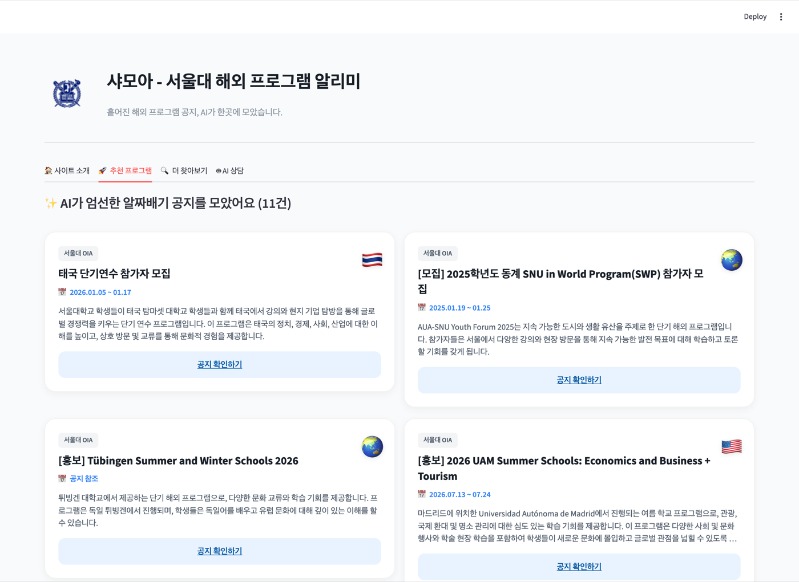
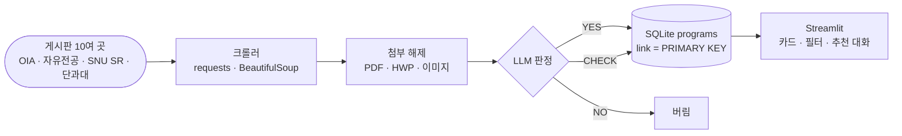

# 샤모아 — 서울대 해외 프로그램 알리미

서울대의 해외 파견·교환·국제교류 프로그램 공지가 단과대별 게시판에 흩어져 있어서, 한곳에 모아
조건에 맞는 것을 추천받을 수 있게 만든 Streamlit 웹 앱임. 수업 최종 프로젝트로 만들었음. (2025-12)

> *A Streamlit app that crawls scattered Seoul National University notice boards, uses an LLM
> to decide which postings are actually study-abroad or exchange opportunities, and lets a
> student browse and ask for recommendations. A class final project.*



<sub>`추천 프로그램` 탭 — LLM이 `YES`로 판정한 공지만 카드로 모아 보여 줌. 출처 게시판, 모집 기간,
요약, 원문 링크가 함께 붙음.</sub>

---

## 무엇을 하는가

| 단계 | 내용 |
|---|---|
| **수집** | 국제협력본부(OIA)·자유전공학부·SNU SR과 단과대 게시판 등 10여 곳을 크롤링 |
| **본문 확보** | 게시글 본문에 더해 첨부 PDF(`pdfplumber`)·HWP(`olefile`)·이미지까지 텍스트로 확보 |
| **선별** | LLM이 공지마다 `YES` / `CHECK` / `NO`로 판정하고 대상·기간·판단 이유를 함께 뽑음 |
| **저장** | 판정 결과를 SQLite `programs` 테이블에 저장 (`link`가 기본키) |
| **탐색·추천** | `YES`·`CHECK`만 카드로 보여 주고, GPT-4o 스트리밍 대화로 상황에 맞는 프로그램을 추천 |



## 구성

```
app.py            Streamlit 앱 — 목록 탐색, 필터, 추천 대화
final_project.py  수집·선별 파이프라인 (크롤링 → 첨부 파싱 → LLM 판정 → DB 저장)
snu_programs.db   판정까지 끝난 프로그램 데이터 (SQLite)
snu_logo.png      UI 로고
```

## 설계에서 신경 쓴 부분

- **판정을 예/아니오 둘이 아니라 셋으로 나눴음.** 확신이 60~90%인 공지는 버리지 않고 `CHECK`로
  남겨 사용자에게 보여 줌. 이런 게시판에서 진짜 비용은 관련 없는 공지를 몇 개 더 보는 것이 아니라,
  마감이 임박한 기회 하나를 놓치는 것이기 때문임.
- **첨부파일까지 읽음.** 국내 대학 공지는 본문이 비어 있고 내용이 HWP·PDF·이미지 안에 들어 있는
  경우가 흔함. 본문만 읽으면 정작 중요한 공지가 통째로 비어 보이므로, HWP는 `olefile`로, PDF는
  `pdfplumber`로 풀고, 이미지는 base64로 인코딩해 비전 모델에 넘김.
- **글 주소를 기본키로 씀.** 게시판마다 날짜 표기와 목록 정렬이 제각각이라 날짜 기준으로는 중복
  판정이 흔들림. 링크를 `PRIMARY KEY`로 두면 여러 번 다시 수집해도 같은 글은 한 번만 남음.
- **API 키를 코드에 넣지 않음.** Streamlit secrets로만 주입하므로 저장소에 키가 남지 않음.

## 실행

```bash
pip install -r requirements.txt
streamlit run app.py
```

```toml
# .streamlit/secrets.toml
OPENAI_API_KEY = "..."
```

수집을 다시 돌려 DB를 갱신하려면 `python final_project.py`를 실행함.

## 한계와 주의

- 수업 최종 프로젝트라 **2025년 12월 시점의 게시판 구조와 데이터 스냅샷**에 맞춰져 있음. 게시판이
  개편되면 해당 사이트는 조용히 0건이 됨.
- 대상 사이트 목록(`SITES`)과 DB 파일명이 `final_project.py`에 하드코딩되어 있음.
- 크롤링 시 `verify=False`로 TLS 검증을 끄고 있음. 일부 학교 사이트의 인증서 문제를 넘기려던
  것으로, 그대로 두고 쓸 코드는 아님.
- LLM 판정은 완전하지 않음. `CHECK` 항목은 사람이 확인하는 것을 전제로 함.
- 앱을 띄우려면 `OPENAI_API_KEY`가 있어야 함(모듈 최상단에서 클라이언트를 만듦). 위 화면은 저장된
  `snu_programs.db`를 그대로 읽어 그린 것임.
